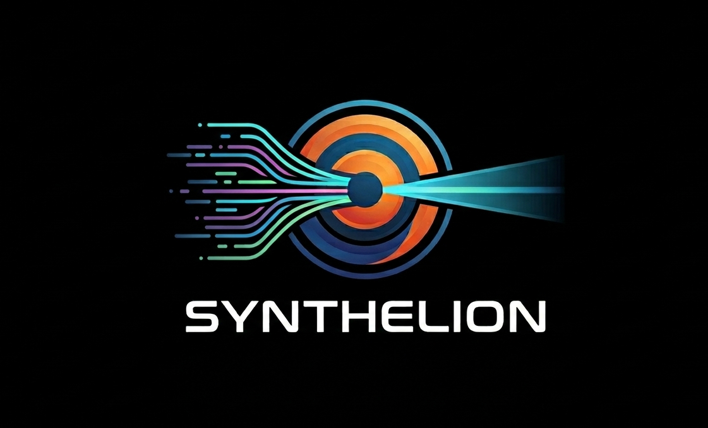

# Synthelion — Universal Token Compressor and Prompt Manager for AI Agents

Synthelion compresses prompts before they reach any AI model — cutting token usage by up to 70%, reducing API costs, and speeding up responses. It works with **any agent or framework**: Claude Code, OpenAI, LangChain, OpenCode, Cursor, and more.

Supports 50+ languages out of the box. No AI model required. No configuration.

> "Why use many tokens when few tokens do trick?" — A caveman (and your wallet).

---

## Why Synthelion?

Every token sent to a model costs money and time. Synthelion removes the words that carry no meaning — articles, prepositions, conjunctions, auxiliary verbs — and reduces inflected words to their base form. The model receives exactly the same information, just without the grammatical packaging.

### Before / After

**English prose** — 20 tokens → 7 tokens (−65%)
```
Before: I would like to know if it is possible to receive information about
        cheap restaurants in Rome.

After:  know possible receive information cheap restaurant Rome
```

**Italian prose** — 17 tokens → 8 tokens (−52%)
```
Before: Vorrei sapere se è possibile ricevere informazioni sui ristoranti
        economici a Roma, per favore.

After:  sapere possibile ricevere informazione ristorante economico Roma
```

**JSON array** — 256 tokens → 80 tokens (−69%)
```json
// Before: full JSON with repeated keys on every object
[{"name":"Alice","age":30,"city":"Rome"},{"name":"Bob","age":25,"city":"Milan"},…]

// After: lossless markdown table
| name  | age | city  |
| ----- | --- | ----- |
| Alice | 30  | Rome  |
| Bob   | 25  | Milan |
```

**HTML page** — 192 tokens → 58 tokens (−70%)
```
// Before: full HTML with tags, attributes, scripts
<html><head>…</head><body><div class="…"><p>Visit Rome today…</p></div></body></html>

// After: clean extracted text, then NLP-compressed
Visit Rome today enjoy ancient history food culture
```

---

### Benchmark — token savings by content type

Measured on GPT-4 token counts with real inputs.

#### NLP compression

| Content | Original tokens | Light | Semantic | Aggressive |
|:---|---:|:---:|:---:|:---:|
| Prose EN | 92 | −35.9% | −34.8% | −34.8% |
| Prose IT | 93 | −23.7% | −28.0% | **−51.6%** |
| Prose DE | 81 | −25.9% | −28.4% | −35.8% |
| Prose FR | 65 | −33.8% | −32.3% | −38.5% |
| Prose ES | 51 | −27.5% | −19.6% | −27.5% |
| JSON array | 256 | −66.8% | **−68.8%** | **−68.8%** |
| Git diff | 196 | −51.0% | −58.2% | −58.2% |
| Build log | 207 | −32.4% | **−62.3%** | **−62.3%** |
| Markdown table | 158 | −60.8% | **−64.6%** | **−64.6%** |
| HTML page | 192 | −45.3% | −49.0% | −50.0% |
| Source code | 249 | −41.0% | −41.0% | −41.0% |

#### Content router (Balanced profile — auto-selects the best strategy)

| Content | Original | After | Saved | Strategy |
|:---|---:|---:|:---:|:---|
| Prose EN | 92 | 60 | −34.8% | NlpCompression |
| JSON array | 256 | 134 | **−47.7%** | JsonCrush:MarkdownTable |
| Git diff | 196 | 137 | −30.1% | DiffCompression |
| HTML page | 192 | 58 | **−69.8%** | HtmlExtract+NlpCompression |
| Source code | 249 | 184 | −26.1% | CodeCompression |

---

### What this means for your costs

Token pricing varies by model. As a rough example with GPT-4o ($2.50 / 1M input tokens):

| Daily input volume | Without Synthelion | With Synthelion (40% avg savings) | Annual saving |
|:---|---:|---:|---:|
| 500K tokens/day | $456/year | $274/year | **$182/year** |
| 2M tokens/day | $1,825/year | $1,095/year | **$730/year** |
| 10M tokens/day | $9,125/year | $5,475/year | **$3,650/year** |

Savings scale with volume. For agent loops that send the same context on every call, real savings are often higher than the 40% average.

### Energy & sustainability

Synthelion includes a built-in energy estimator. Every saved token avoids approximately **0.005 mWh** of compute energy and **0.002 mg CO₂**. At scale, that adds up.

```python
result = svc.compress(long_prompt, CompressionLevel.SEMANTIC)
print(f"Energy saved: {result.estimated_energy_saved_mwh:.3f} mWh")
print(f"CO₂ avoided:  {result.estimated_co2_saved_mg:.3f} mg")
```

---

## Quick install — one command

> The fastest way: download one script and run it. It installs Synthelion, detects your Python path, configures Claude Code MCP, and sets up the auto-compression hook automatically.

### Windows (PowerShell)

```powershell
# Download and run
Invoke-WebRequest https://raw.githubusercontent.com/francescopaolopassaro/synthelion/main/install_claude.ps1 -OutFile install_claude.ps1
powershell -ExecutionPolicy Bypass -File install_claude.ps1
```

Or, if you already cloned the repo:
```powershell
powershell -ExecutionPolicy Bypass -File install_claude.ps1
```

### Linux / macOS (bash)

```bash
curl -fsSL https://raw.githubusercontent.com/francescopaolopassaro/synthelion/main/install_claude.sh | bash
# or, after cloning the repo:
chmod +x install_claude.sh && ./install_claude.sh
```

### All platforms (Python — works everywhere)

```bash
python install_claude.py
```

### Installer options

| Flag | Description |
|---|---|
| `--upgrade` | Update Synthelion to the latest version |
| `--no-hook` | Skip the auto-compression hook |
| `--no-pip` | Skip pip install (Synthelion already installed) |
| `--uninstall` | Remove Synthelion and all Claude Code config |

Examples:
```bash
python install_claude.py --upgrade          # update
python install_claude.py --uninstall        # remove everything
python install_claude.py --no-pip --no-hook # only update settings.json
```

---

## Install (manual)

**Requirements:** Python 3.11+ — download from [python.org](https://www.python.org/downloads/) and tick "Add to PATH" during setup.

```powershell
# 1. Install Synthelion
pip install synthelion

# 2. Verify the CLI works
synthelion compress --text "Hello world, how are you today?" --json

# 3. Verify the MCP server starts (Ctrl+C to stop)
synthelion-mcp
```

If `synthelion` is not recognised after install, close and reopen the terminal (PATH refresh needed).

---

### Linux

```bash
# 1. Install Synthelion
pip install synthelion
# or, in a virtualenv:
python3 -m venv ~/.venvs/synthelion
source ~/.venvs/synthelion/bin/activate
pip install synthelion

# 2. Verify
synthelion compress --text "Hello world, how are you today?" --json

# 3. If synthelion-mcp is not in PATH (virtualenv scenario), add it:
# Add the venv's bin directory to ~/.bashrc or use the absolute path in MCP config
echo 'export PATH="$HOME/.venvs/synthelion/bin:$PATH"' >> ~/.bashrc
source ~/.bashrc
```

---

### macOS

```bash
# 1. Install with pip (system Python or Homebrew Python)
pip3 install synthelion
# or with uv (recommended — no PATH issues):
pip install uv
uvx synthelion-mcp   # runs the MCP server without a permanent install

# 2. Verify
synthelion compress --text "Hello world, how are you today?" --json
```

---

### Zero-install with uvx (all platforms)

[uv](https://docs.astral.sh/uv/) installs and runs Synthelion in an isolated environment — no `pip install` needed:

```bash
pip install uv       # one-time
uvx synthelion-mcp   # starts the MCP server directly
```

---

## Update

### Windows

```powershell
pip install --upgrade synthelion

# Verify new version
synthelion --version
```

### Linux / macOS

```bash
pip install --upgrade synthelion
# or, if installed in a virtualenv:
source ~/.venvs/synthelion/bin/activate
pip install --upgrade synthelion
```

### With uv / uvx

uvx always fetches the latest version automatically — nothing to do.

---

## Set up on Claude Code

Claude Code uses the MCP protocol to talk to Synthelion.

### Step 1 — Install Synthelion (see above)

### Step 2 — Add to `~/.claude/settings.json`

Open the file (`%USERPROFILE%\.claude\settings.json` on Windows, `~/.claude/settings.json` on Linux/macOS) and add:

```json
{
  "mcpServers": {
    "synthelion": {
      "command": "synthelion-mcp"
    }
  }
}
```

If `synthelion-mcp` is not in PATH (virtualenv, macOS Homebrew Python), use the absolute path:

```json
{
  "mcpServers": {
    "synthelion": {
      "command": "/home/user/.venvs/synthelion/bin/synthelion-mcp"
    }
  }
}
```

Or use uvx — it always works without PATH issues:

```json
{
  "mcpServers": {
    "synthelion": {
      "command": "uvx",
      "args": ["synthelion-mcp"]
    }
  }
}
```

### Step 3 — Restart Claude Code

Close and reopen the Claude Code window (or run `claude` again in the terminal). Synthelion is now available as an MCP tool.

### Step 4 — Verify

Type in Claude Code:
> *"Use Synthelion to compress this: I would like to know if it is possible to receive information about cheap restaurants in Rome."*

Claude will call the MCP tool and return the compressed version.

---

## Automatic prompt compression — Claude Code hook

> **How it works:** every prompt longer than 200 characters is automatically compressed by Synthelion and the compressed version is injected as context for Claude. Claude receives both the original and the compressed form and focuses on the compressed one. This is the maximum automation currently possible within Claude Code's hook system (hooks cannot replace the original prompt text).

### Windows (`~/.claude/settings.json`)

```json
{
  "mcpServers": {
    "synthelion": { "command": "synthelion-mcp" }
  },
  "hooks": {
    "UserPromptSubmit": [
      {
        "hooks": [
          {
            "type": "command",
            "shell": "powershell",
            "command": "$j=[Console]::In.ReadToEnd()|ConvertFrom-Json;$p=$j.prompt;if($p -and $p.Length -gt 200){$r=($p|synthelion compress --json 2>$null)|ConvertFrom-Json;if($r -and $r.efficiency_pct -gt 15){@{hookSpecificOutput=@{hookEventName='UserPromptSubmit';additionalContext=\"[Synthelion $([Math]::Round($r.efficiency_pct))% token reduction] $($r.compressed)\"}}|ConvertTo-Json -Compress}}",
            "statusMessage": "Compressing prompt...",
            "timeout": 15
          }
        ]
      }
    ]
  }
}
```

### Linux / macOS (`~/.claude/settings.json`)

```json
{
  "mcpServers": {
    "synthelion": { "command": "synthelion-mcp" }
  },
  "hooks": {
    "UserPromptSubmit": [
      {
        "hooks": [
          {
            "type": "command",
            "shell": "bash",
            "command": "prompt=$(cat | python3 -c \"import sys,json; print(json.load(sys.stdin).get('prompt',''))\"); if [ ${#prompt} -gt 200 ]; then r=$(printf '%s' \"$prompt\" | synthelion compress --json 2>/dev/null); eff=$(printf '%s' \"$r\" | python3 -c \"import sys,json; d=json.load(sys.stdin); print(int(d.get('efficiency_pct',0)))\"); comp=$(printf '%s' \"$r\" | python3 -c \"import sys,json; print(json.load(sys.stdin).get('compressed',''))\"); if [ \"$eff\" -gt 15 ]; then python3 -c \"import json; print(json.dumps({'hookSpecificOutput':{'hookEventName':'UserPromptSubmit','additionalContext':'[Synthelion {}% saved] {}'.format($eff,'$comp')}}))\" ; fi; fi",
            "statusMessage": "Compressing prompt...",
            "timeout": 15
          }
        ]
      }
    ]
  }
}
```

### How to disable the hook

Remove the `"hooks"` block from `~/.claude/settings.json`, or open `/hooks` in Claude Code to toggle it.

---

## Using Synthelion with all agents — automatic compression

Synthelion can compress inputs automatically for **any agent** that supports the MCP protocol (Claude Code, Claude Desktop, OpenCode, Cursor, Windsurf, Continue…).

### Configure all MCP-compatible agents

Add Synthelion to each agent's config file:

| Agent | Config file |
|---|---|
| Claude Code | `~/.claude/settings.json` |
| Claude Desktop (macOS) | `~/Library/Application Support/Claude/claude_desktop_config.json` |
| Claude Desktop (Windows) | `%APPDATA%\Claude\claude_desktop_config.json` |
| OpenCode | `~/.config/opencode/config.json` |
| Cursor / Windsurf | MCP settings in the app UI |
| Continue | `.continue/config.json` |

All use the same JSON block:
```json
{
  "mcpServers": {
    "synthelion": {
      "command": "synthelion-mcp"
    }
  }
}
```

### Instruct agents to compress automatically

Add this to your agent's system prompt or CLAUDE.md:

```
When processing long texts, files, or documents (>200 tokens), always use
the Synthelion MCP tool to compress the content before including it in your
reasoning. Call: mcp__synthelion__route_content or mcp__synthelion__compress.
Report the token reduction achieved.
```

### Use the CLI in shell pipelines

```bash
# Compress a file before sending to any LLM API
cat long_context.txt | synthelion compress --level semantic > compressed.txt

# Pipe directly into any tool
synthelion route --file document.html | llm-cli --model gpt-4o

# Batch compress a directory
for f in docs/*.md; do
  synthelion compress --text "$(cat $f)" --json >> compressed_batch.jsonl
done
```

---

## Integrations

---

### OpenAI — GPT-4, GPT-4o, Codex, and any OpenAI-compatible API

```python
from openai import OpenAI
from synthelion.plugins.openai_tools import get_tool_definitions, execute_tool

client = OpenAI()
tools = get_tool_definitions()

response = client.chat.completions.create(
    model="gpt-4o",
    messages=[{"role": "user", "content": "Compress this text: I would like to know if it is possible..."}],
    tools=tools,
    tool_choice="auto",
)

# Handle tool calls returned by the model
for tool_call in response.choices[0].message.tool_calls or []:
    result = execute_tool(tool_call.function.name, tool_call.function.arguments)
    print(result)
```

---

### LangChain — LangGraph, LCEL, ReAct agents

```bash
pip install "synthelion[langchain]"
```

```python
from synthelion.plugins.langchain_tools import get_tools
from langchain_openai import ChatOpenAI
from langgraph.prebuilt import create_react_agent

llm = ChatOpenAI(model="gpt-4o")
tools = get_tools()

agent = create_react_agent(llm, tools)
result = agent.invoke({"messages": [{"role": "user", "content": "Compress this prompt: ..."}]})
```

Works with any LangChain-compatible LLM (OpenAI, Anthropic, Groq, Ollama, …).

---

### Python API — any custom agent or pipeline

```python
from synthelion import CompressionService, CompressionLevel, ContentRouter, CompressionProfile

# Compress text
svc = CompressionService()
result = svc.compress(
    "I would like to know if it is possible to receive information about cheap restaurants in Rome.",
    CompressionLevel.SEMANTIC,
)
print(result.compressed_text)   # "know possible receive information cheap restaurant Rome"
print(f"{result.efficiency_pct:.1f}% saved")

# Auto-route any content type (JSON, HTML, diff, log, code, prose)
router = ContentRouter.from_profile(CompressionProfile.BALANCED)
routed = router.route(my_content)
print(routed.strategy_used, f"{routed.savings_pct:.1f}% saved")
```

---

### CLI — shell scripts, pipelines, any language

```bash
# Compress text
synthelion compress --text "I would like to know if it is possible..." --level semantic

# Detect language
synthelion detect --text "Guten Morgen, wie geht es Ihnen?"

# Auto-route a file
synthelion route --file context.json

# Summarize
synthelion summarize --text "..." --sentences 3

# Start MCP server manually
synthelion serve-mcp
```

Pipe-friendly — reads from stdin if no `--text` or `--file` is given:

```bash
cat big_prompt.txt | synthelion compress --level aggressive
```

---

## Tools

| Tool | What it does |
|---|---|
| **compress** | Removes stop words, lemmatizes content words. Up to 70% token reduction. |
| **detect_language** | Identifies language of any text. Returns ISO 639-3 code. |
| **route_content** | Auto-detects JSON, HTML, diff, log, code or prose and applies the best algorithm. |
| **summarize** | Extractive summarization — keeps the most important sentences (TF-IDF or TextRank). |
| **compress_batch** | Compresses a list of texts in one call. |

---

## Code examples

### Text compression

```python
from synthelion import CompressionService, CompressionLevel

svc = CompressionService()

# Semantic (default) — removes stop words and lemmatizes
r = svc.compress(
    "I would like to know if it is possible to receive information about cheap restaurants in Rome.",
    CompressionLevel.SEMANTIC,
)
print(r.compressed_text)      # know possible receive information cheap restaurant Rome
print(f"{r.efficiency_pct:.1f}% saved")   # 65.0% saved
print(f"{r.original_tokens} → {r.compressed_tokens} tokens")

# Aggressive — also removes generic verbs and adjectives
r = svc.compress("The important thing is to find a good and reliable solution.", CompressionLevel.AGGRESSIVE)
print(r.compressed_text)      # important find reliable solution

# Explicit language (skip auto-detection)
r = svc.apply_compression(
    "Ich hätte gerne einen Kaffee, bitte.",
    iso3="deu",
    level=CompressionLevel.SEMANTIC,
)
print(r.compressed_text)      # Kaffee

# Batch — compress many prompts at once
results = svc.compress_batch(
    ["Tell me about Rome.", "What is the capital of France?", "Explain neural networks."],
    CompressionLevel.SEMANTIC,
)
for r in results:
    print(r.compressed_text, f"({r.efficiency_pct:.0f}% saved)")
```

---

### Language detection

```python
from synthelion import LanguageDetector

det = LanguageDetector()

print(det.detect("Wo ist der nächste Bahnhof?"))        # deu
print(det.detect("Je voudrais une table pour deux."))   # fra
print(det.detect("Quiero información sobre Madrid."))   # spa

# Confidence scores for all matched languages
scores = det.detect_with_scores("Where is the nearest train station?")
# → {"eng": 0.42, "afr": 0.05, ...}
top = sorted(scores.items(), key=lambda x: x[1], reverse=True)[:3]
print(top)   # [("eng", 0.42), ...]
```

---

### Content router — auto-detects and picks the best algorithm

```python
from synthelion import ContentRouter, CompressionProfile

router = ContentRouter.from_profile(CompressionProfile.BALANCED)

# JSON array → lossless markdown table or BM25 row-drop
json_data = '[{"name":"Alice","age":30,"city":"Rome"},{"name":"Bob","age":25,"city":"Milan"}]'
r = router.route(json_data)
print(r.strategy_used)   # JsonCrush:MarkdownTable
print(r.compressed)
# | name  | age | city  |
# | Alice | 30  | Rome  |
# | Bob   | 25  | Milan |
print(f"{r.savings_pct:.1f}% saved")

# HTML → extract text, then NLP-compress
html = "<html><body><h1>Visit Rome</h1><p>Rome is a beautiful city with ancient history.</p></body></html>"
r = router.route(html)
print(r.strategy_used)   # HtmlExtract+NlpCompression
print(r.compressed)      # Visit Rome Rome beautiful city ancient history

# Git diff → keeps +/- lines, trims context
diff = """--- a/main.py\n+++ b/main.py\n@@ -10,7 +10,7 @@\n def hello():\n-    print("Hello world")\n+    print("Hello Synthelion")\n     return True"""
r = router.route(diff)
print(r.strategy_used)   # DiffCompression

# Build log → deduplicates repeated lines
log = """ERROR: connection refused\nERROR: connection refused\nERROR: connection refused\nINFO: retrying..."""
r = router.route(log)
print(r.compressed)      # ERROR: connection refused  [×3]\nINFO: retrying...

# Source code → strips comments and blank lines
code = """
def greet(name):
    # This function greets the user
    # It prints a greeting message
    print(f"Hello, {name}!")  # say hello
"""
r = router.route(code)
print(r.compressed)      # def greet(name):\n    print(f"Hello, {name}!")
```

---

### Summarization

```python
from synthelion.nlp import TfIdfSummarizer, TextRankSummarizer

long_text = """
Rome is the capital of Italy and one of the most visited cities in the world.
It was founded in 753 BC and served as the center of the Roman Empire for centuries.
The city contains numerous ancient monuments including the Colosseum, the Pantheon,
and the Roman Forum. Vatican City, an independent state within Rome, is the seat of
the Catholic Church. Today Rome is a major European capital with a population of
nearly three million people. Its economy is driven by tourism, culture, and public
administration. Every year millions of tourists visit from every corner of the globe.
"""

# TF-IDF — best for factual/report text, picks sentences with rare distinctive words
tfidf = TfIdfSummarizer()
print(tfidf.summarize(long_text, sentence_count=3))

# TextRank — best for narrative text, picks sentences central to the storyline
tr = TextRankSummarizer()
print(tr.summarize(long_text, ratio=0.4))   # keep 40% of sentences

# Chain: summarize first, then compress — maximum token savings
summary = tr.summarize(long_text, sentence_count=3)
from synthelion import CompressionService, CompressionLevel
compressed = CompressionService().compress(summary, CompressionLevel.SEMANTIC)
print(compressed.compressed_text)
print(f"Final size: {compressed.compressed_tokens} tokens (was {len(long_text.split())})")
```

---

### Agent memory & context window

```python
from synthelion.agent import ContextWindow, MemoryStore, MemoryExtractor

# Rolling context window — auto-compacts when it exceeds the token budget
window = ContextWindow(max_tokens=2000, keep_last_turns=4)

for i in range(20):
    window.append("user", f"Message {i}: tell me about topic {i} in great detail...")
    window.append("assistant", f"Response {i}: here is a detailed explanation of topic {i}...")

print(f"Messages in window: {window.message_count}")   # stays bounded
print(window.to_messages_json(indent=2))               # ready for any LLM API

# Long-term memory across sessions
extractor = MemoryExtractor()
note = extractor.extract("The user lives in Rome and works in tech. They prefer Python over C#.", max_sentences=2)
# → {"summary": "User lives Rome works tech.", "keywords": ["Rome", "Python", "tech"]}

store = MemoryStore()
store.remember(note)
store.remember({"summary": "User prefers dark mode and short answers.", "keywords": ["dark mode", "concise"]})

# Save to disk, restore next session
json_blob = store.save()
store2 = MemoryStore()
store2.load(json_blob)

# Recall what's relevant for the current query
hits = store2.recall("What does the user prefer for coding?", top_k=2)
print(hits[0]["summary"])   # User lives Rome works tech.
```

---

## Compression levels

| Level | What it removes | Typical savings |
|---|---|---|
| `light` | Stop words (articles, prepositions, conjunctions…) | 25–35% |
| `semantic` | Stop words + lemmatization to base form | 30–69% |
| `aggressive` | Everything above + generic verbs and descriptive adjectives | 35–70% |

Default: `semantic`.

---

## Supported languages (50+)

Afrikaans · Arabic · Armenian · Basque · Belarusian · Bengali · Bulgarian · Catalan · Chinese · Croatian · Czech · Danish · Dutch · English · Estonian · Finnish · French · Galician · German · Greek · Hebrew · Hindi · Hungarian · Icelandic · Indonesian · Irish · Italian · Japanese · Kannada · Kazakh · Korean · Latin · Latvian · Lithuanian · Macedonian · Malay · Marathi · Norwegian · Persian · Polish · Portuguese · Romanian · Russian · Serbian · Slovak · Slovenian · Spanish · Swedish · Tamil · Telugu · Thai · Turkish · Ukrainian · Urdu · Vietnamese

Language is detected automatically from the text. Pass an explicit ISO 639-3 code to override.

---

## Troubleshooting

**`synthelion-mcp: command not found`**

The CLI entry point is not in your PATH. Fixes (choose one):

```json
// Option A — use the Python module form
{
  "mcpServers": {
    "synthelion": {
      "command": "python",
      "args": ["-m", "synthelion.plugins.mcp_server"]
    }
  }
}
```

```json
// Option B — use uvx (always works, no PATH needed)
{
  "mcpServers": {
    "synthelion": {
      "command": "uvx",
      "args": ["synthelion-mcp"]
    }
  }
}
```

```json
// Option C — absolute path to the installed binary
// Windows: find it with: where synthelion-mcp
// Linux/macOS: which synthelion-mcp
{
  "mcpServers": {
    "synthelion": {
      "command": "C:\\Users\\you\\AppData\\Local\\Programs\\Python\\Python312\\Scripts\\synthelion-mcp.exe"
    }
  }
}
```

**Hook not firing (Windows)**

Run `where synthelion` in PowerShell to verify the CLI is in PATH. If not, add the Scripts folder to PATH:
```powershell
$env:PATH += ";$env:APPDATA\Python\Python312\Scripts"
```

**Hook not firing (Linux/macOS)**

Verify with `which synthelion`. If using a virtualenv, activate it before starting Claude Code or use the absolute path in the hook command.

**Detection errors (wrong language detected)**

Pass the language explicitly:
```bash
synthelion compress --text "..." --language ita
```

Or in Python:
```python
result = svc.compress(text, iso3="ita")
```

---

## Links

- **PyPI:** https://pypi.org/project/synthelion/
- **Source:** https://github.com/francescopaolopassaro/synthelion
- **Original C# project (Caveman):** https://github.com/francescopaolopassaro/caveman

© 2026 Passaro Francesco Paolo — Digitalsolutions.it
